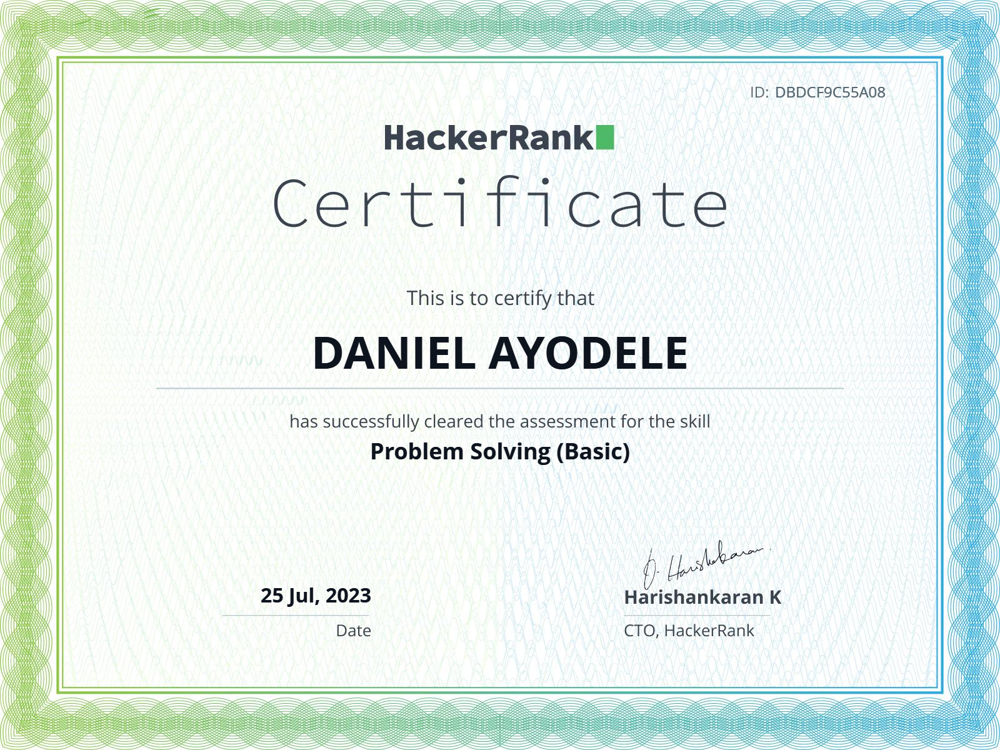
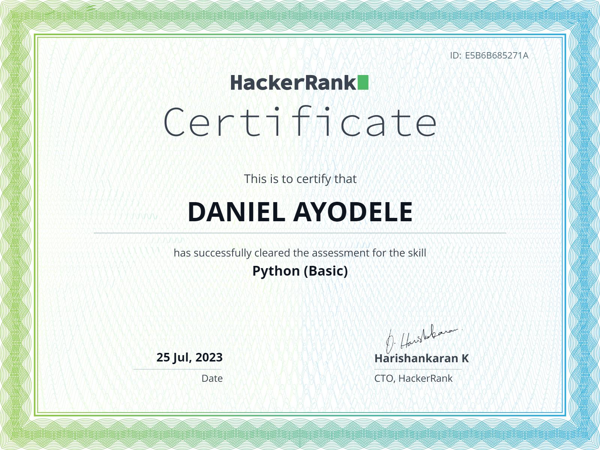

# Data Scientist

#### Technical Skills: Python, SQL, Microsoft Excel, Power BI

## Education			        		
- B.S., Computer Science | The University of Ibadan (February 2021 till date)

## Work Experience
**Data Science Intern @ Training, Research and Development Institute,University of Ibadan (_June 2023 - Present_)**
-I had the unique opportunity to contribute to a cutting-edge project focused on detecting fake reviews within online platforms. Throughout my internship, I was actively involved in every phase of the project, from data collection to model implementation. This role provided me with valuable hands-on experience in the field of data analysis, machine learning, and cybersecurity.

## Projects
### Explortory Data Analytics: Exploring Airbnb Data Insights
I undertook an insightful data analysis project to gain a comprehensive understanding of New York City's Airbnb market in 2019. Leveraging Python's powerful data analysis libraries, including Pandas, Seaborn, and Matplotlib, I conducted thorough exploratory data analysis (EDA) to uncover patterns, trends, and meaningful insights from the dataset.

## Certifications and Badges
- HackerRank Problem Solving(Basic) Certificate
  

- HackerRank Python(Basic) Certificate
- 
- 
